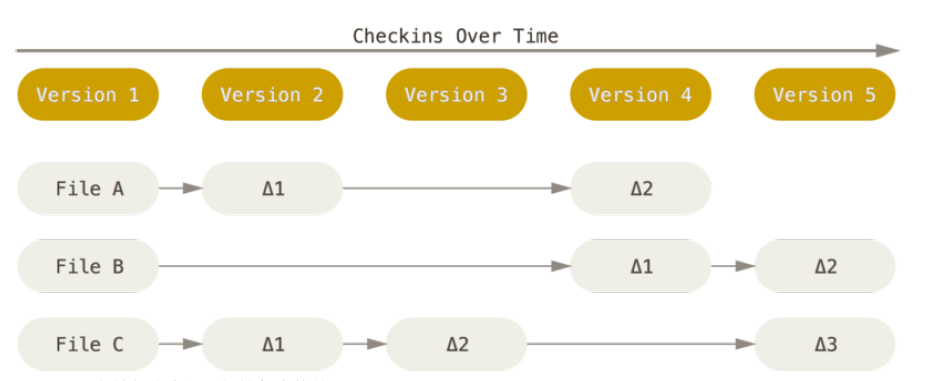
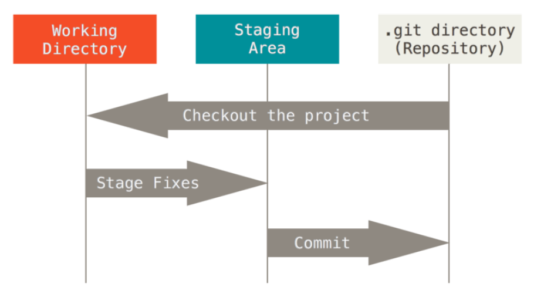
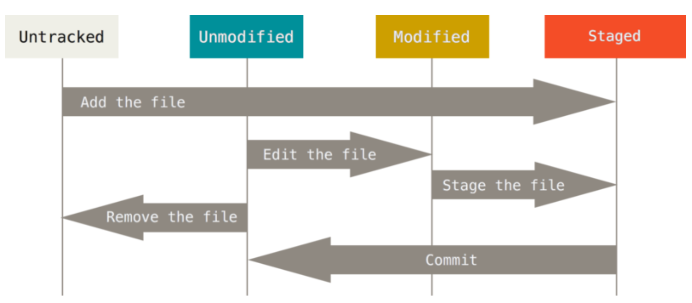

## 起步

### 关于版本控制

#### 本地版本控制系统

​	在不使用任何工具的情况下, 我们的备份往往是直接对文件或者文件目录的复制.

​	后来开发了很多种==本地版本控制系统==, 大多都是采==用某种简单的数据库来记录文件的历次更新差异==. 其中最流行的一种叫做RCS, 它主要关注单个文件的版本控制. 工作原理是在硬盘上保存补丁集.


#### 集中化的版本控制系统

​	接下来遇到的问题是, 如何让在不同系统上的开发者协同工作. 于是==集中化的版本控制系统(CVCS)应运而生==. 如CVS, SVN以及Perforce等, 都有一个单一的集中管理的服务器, 保存所有文件的修订版本, 协同工作的人们通过客户端连到这台服务器.

​	这种做法的好处是每个人都可以在一定程度上看到项目中的其他人正在做什么. 管理员也可以掌控每个开发者的权限. 并且管理一个统一的CVCS要比在各个客户端上维护本地数据库更轻松容易.

​	缺点是中央服务器的单点故障. 如宕机时间内无法提交更新, 也就无法协同工作; 若磁盘发生损坏, 也没有备份, 将丢失所有数据, 只剩下在各自机器上保留的单独快照.


#### 分布式版本控制系统

​	于是诞生了==分布式版本控制系统(DVCS)==, 像Git, Mervurial, Bazaar, Darcs等. 客户端并==不只是提取最新版本的快照, 而是把代码仓库完整地镜像下来==. 这样如果服务器发生故障, 可以用任何一个镜像出来的本地仓库恢复. 因为每一次克隆, 都是对仓库代码的完整备份, 包括整个变更历史. 

​	更进一步, 许多这类系统可以指定和若干不同的远端代码仓库进行交互.


### Git简史

1991-2002: linux内核开源项目的绝大多数维护工作都花在了提交补丁和保存归档的繁琐事务上.

2002-2005: 整个项目组开始启用分布式版本控制系统BitKeeper来管理和维护代码.

2005: BitKeeper同Linux内核开源社区的合作关系结束, Linux Torvalds主导开发自己的版本系统Git.


### 认识Git

#### 直接记录快照, 而非差异比较

​	SVN以文件变更列表的方式存储数据, 将保存的信息看作是一组基本文件和每个文件随时间逐步累积的差异.



​	

​	Git则更像是把数据看作是对==小型文件系统==的一组快照. 每次提交更新时, 它主要对当时的全部文件制作一个快照并保存这个快照的索引. 如果某个文件没有修改, 就不会重新存储该文件, 而是保留一个链接指向之前存储的文件. Git对待数据更像是一个快照流.


​		Git更像一个小型的文件系统, ==提供了许多以此为基础构建的超强工具, 而不只是一个简单的VCS==.


#### 几乎所有操作都是本地执行

​	绝大多数操作只需访问本地文件和资源.

​	SVN(其他集中式版本管理系统也是如此)如果要切换到某一个过去的版本, 则需要访问服务器, 通过保存在服务器中的原始文件和增量差异, 计算出该版本.


#### Git保证完整性

​	Git中的所有数据在存储前都计算==校验和==, 然后以校验和来引用. 

​	用以计算校验和的机制叫做SHA-1(hash, 哈希). 是一个由40个十六进制字符组成的字符串.基于Git中文件的内容或目录结构计算出来.

​	Git数据库中, 保存的信息都是以文件内容的哈希值来索引, 而不是文件名.


#### Git一般只添加数据

​	我们执行的Git操作, 几乎只往Git数据库中增加数据. 很难让Git执行任何不可逆操作, 或者让它以任何方式清除数据.


#### 三种状态

​	三种状态, 文件可能处于其中之一:

- 已提交(committed)
- 已修改(modified)
- 已暂存(staged)


​	已提交表示数据已经安全的保存在本地数据库中. 

​	已修改表示修改了文件, 但还没保存到数据库中.

​	已暂存表示一个已修改文件的当前版本做了标记, 使之包含在下次提交的快照中.


#### 三个工作区域

由此引出三个工作区域的概念: 工作目录, Git仓库, 暂存区域.




- 工作目录是对项目的某个版本从Git仓库的==压缩数据库==中独立提取出来的内容. 
- Git仓库目录是Git用来保存项目的元数据和==对象数据库==的地方.从其它计算机克隆仓库时, 拷贝过来的就是这里的数据.
- 暂存区域是一个文件, 保存了下次将提交的文件列表信息, 一般在Git仓库目录中. 有时也被称作'索引', 不过一般说法还是叫暂存区域.


#### 基本的Git工作流程

1. 在工作目录中修改文件
2. 暂存文件, 将文件的索引放入暂存区(.git/index). 索引通过哈希值指向文件快照(.git/objects)
3. 提交更新, 找到暂存区域的文件, 将快照永久性存储到Git仓库目录


​	如果Git目录中保存着特定版本文件, 就属于已提交状态. 如果做了修改并已放入暂存区域, 就属于已暂存状态. 如果自上次取出后, 做了修改但还没有放到暂存区域, 就是已修改状态.(后面会了解到, 可以跳过暂存直接提交).


### 命令行

​	只有在命令行模式下才能执行Git的所有命令, 而大多数的GUI软件只实现了Git所有功能的一个子集以降低操作难度. 如果学会了在命令行下如何操作, 那么在操作GUI软件时, 也不会遇到什么困难.

​	不同的人可能会安装不同的GUI软件, 但所有人一定会有命令行工具.


### 安装Git

​	推荐安装最新版, 但这篇笔记的参考书pro git用的是2.0.0版本.

​	因为Git在保持向后兼容方面表现很好, 因此后面介绍的命令在2.0之后的版本应当有效.


### 初次运行Git前的配置

​	定制Git环境. 每台计算机上只需要配置一次, 程序升级时会保留配置信息. 

1. `/etc/gitconfig`文件, 包含系统上每一个用户及他们仓库的通用配置. 如果使用带有`--system`选项的`git config`时, 它会从此文件读写配置变量
2. `~/.gitconfig`或`~/.config/git/config`文件, 只针对当前用户. 可以传递`--global`选项让Git读写此文件
3. 当前使用仓库的Git目录中的`.git/config`文件, 只针对该仓库


​	每一个级别覆盖上一级别的配置.

​	在Windows系统中, Git会查找`$HOME`目录下的`.gitconfig`文件. 以及`/etc/gitconfig`文件, 但只限于MSys的根目录下, 即安装Git时所选的目标位置.


#### 用户信息

​	==安装完后的第一件事==就是应该设置用户名称和邮件地址.  这很重要, 因为每一个提交都会使用这些信息, 并且会写入到每一次提交中, 不可更改.

```shell
git config --global user.name "John Doe"
git config --global user.email johndoe@example.com
```


#### 文本编辑器

​	还可以配置文本编辑器. 当git需要你输入信息时会调用它(比如需要你输入提交的comment信息时). 如果未配置, Git会使用操作系统默认的文本编辑器, 通常是Vim. 如果想使用emacs:

```shell
git config --global core.editor emacs
```


#### 检查配置信息

​	使用`git config --list`命令来列出所有Git当前能找到的配置.		

​	如果看到重复的变量名, 是因为Git从不同的文件中读取同一个配置, 这种情况下, Git会使用它找到的每一个变量的最后一个配置.

​	可以通过`git config <key>`来检查Git的某一项配置.

```shell
git config user.name
```


### 获取帮助

​	如果使用Git时需要获取帮助, 有三种方法可以找到Git命令的使用手册:

```shell
git help <verb>
git <verb> --help
man git-<verb>

git help config
```

​	除了上述命令, 还可以尝试在Freenode IRC服务器(irc.freenode.net)的`#git`或`#github`频道寻求帮助.


## Git基础

### 获取Git仓库

#### 在现有目录中初始化仓库

​	在项目目录下输入`git init`.  该命令将会创建一个名为`.git`的子目录, 这个子目录含有初始化的Git仓库中所有的必须文件, 这些文件是Git仓库的主干. 但此时, 我们只是做了一个初始化操作, 项目里的文件还没有被跟踪.

​	如果对已经存在的项目进行了Git仓库的初始化, 接下来应该开始跟踪这些文件并提交. 可以通过`git add`命令实现对指定文件的跟踪, 通过`git commit`命令进行提交.

#### 克隆现有的仓库

​	如果要获得一份已经存在了的Git仓库的拷贝, 就要用到`git clone`命令. 之所以使用clone而不是checkout, 是因为Git仓库克隆的是该Git仓库服务器上的==几乎所有数据==, 而不仅仅是复制完成工作所需的文件.当执行`git clone`命令的时候, ==默认配置下远程Git仓库中的每一个文件的每一个版本都将被拉下来.==

​	克隆仓库的命令是`git clone [rurl]`. 例如:

```shell
git clone https://github.com/libgit2/libgit2
```

​	这会在当前目录下创建一个名为“libgit2”的目录, 并在这个目录下初始化一个`.git`文件夹, 从远程仓库拉取的所有数据会放入这个`.git`文件夹, 然后从中读取最新版本的文件的拷贝. 点进这个新建的libgit2文件夹, 就会发现所有的项目文件已经在里面了, 准备就绪等待后续的开发和使用. 如需在克隆远程仓库时自定义本地仓库的名字, 可以使用如下命令:

```shell
git clone https://github.com/libgit2/libgit2 mylibgit
```

​	Git支持多种数据传输协议, 上面的例子使用的是`https://`协议, 不过你也可以使用`git://`协议或者使用SSH传输协议, 各种方式各有利弊.

### 记录每次更新到仓库

​	首先, 工作目录下的每一个文件都不外乎两种状态: 已跟踪或未跟踪.已跟踪的文件是指那些被纳入了版本控制的文件, 在上一次快照中有它们的记录, 在工作一般时间后, 它们的状态可能处于未修改, 已修改或已放入暂存区. 工作目录中除已跟踪文件以外的所有其它文件都属于未跟踪文件, 它们既不存在于上次快照的记录中, 也没有放入暂存区.初次克隆某个仓库的时候, 工作目录中的所有文件都属于已跟踪文件, 并处于未修改状态.

​	对某些文件进行编辑后, Git将它们标记为已修改文件. 然后逐步将这些已修改的文件放入暂存区, 然后提交所有暂存了的修改, 如此反复. 所以使用Git时文件的生命周期如下:




#### 检查当前文件状态

​	要查看哪些文件处于什么状态, 可以`git status`命令. 如果在克隆仓库后立即使用此命令, 会看到类似如下==输出==:

```shell
On branch master
nothing to commit, working directory clean
```

​	这说明现在的工作目录==相当干净==. 也就是==所有已跟踪文件在上次提交后都未更改过==. 此外, 上面信息还表明, 当前目录下没有出现任何未跟踪状态文件, 否则Git会在这里列出来. 最后, 该命令还显示了当前所在分支, 并且这个分支同远程服务器上对应的分支没有偏离. 

​	当前分支是“master”, 这是默认的分支名, 最新版本Git已将默认分支名改为“main”了.

​	在该项目下创建一个新的文件README后, 再次输入`git status`命令, 将会看到==一个新的未跟踪文件==:

```
On branch master
Untracked files:
  (use "git add <file>..." to include in what will be committed)
    	README
nothing added to commit but untracked files present (use "git add" to track)
```

​	可以看到新建的README文件出现在`Untracked files`下面. 未跟踪的文件意味着Git在之前的快照(提交)中没有这些文件, Git不会自动将之纳入跟踪范围.


#### 跟踪新文件

​	使用`git add`开始跟踪一个文件.

```shell
git add README
```

​	此时, 再运行`git status`命令, 会看到README文件已被跟踪, 并处于暂存状态:

```shell
On branch master
Changes to be committed:
  (use "git reset HEAD <file>..." to unstage)
	  new file: README
```

​	只要在`Changes to be committed`这行下面的, 就说明是已暂存状态. 如果此时提交, 那么该文件此时此刻的版本将被留存在历史记录中.

​	`git add (files)`命令的参数可以是文件或者目录, 如果参数是目录的路径, 该命令将递归地跟踪该目录下的所有文件.


#### 暂存已修改文件

​	修改一个已被跟踪的文件. 然后运行`git status`. 将会看到如下内容:

```shell
On branch master
Changes to be committed:
	(use "git reset HEAD <file>..." to unstage)
	   new file: README
Changes not staged for commit:
	(use "git add <file>..." to update what will be committed)
	(use "git checkout -- <file>..." to discard changes in working directory)
	   modified: CONTRIBUTING.md
```

​	文件CONTRIBUTING.md出现在`Changes not staged for commit:`这行下面, 说明已跟踪文件的内容发生了变化, 但还没有放到暂存区. 要暂存这次更新, 需要运行`git add`命令. ==这是个多功能命令: 可以用它开始跟踪新文件, 或者把已跟踪的文件放到暂存区, 还能用于合并时把有冲突的文件标记为已解决状态等.==将这个命令理解为==添加内容到下一次提交中==, 而不是==将一个文件添加到项目中==要更加合适. 现在运行`git add`把CONTRIBUTING.md放入暂存区, 再看一下`git status`输出:

```shell
On branch master
Changes to be committed:
	(use "git reset HEAD <file>..." to unstage)
	  new file: README
	  modified: CONTRIBUTING.md
```

​	现在暂存区中有两个文件, 下次提交时会一并记录到仓库. 如果此时再次修改CONTRIBUTING.md, 再次运行`git status`看看:

```shell
On branch master
Changes to be committed:
	(use "git reset HEAD <file>..." to unstage)
	  new file: README
	  modified: CONTRIBUTING.md
Changes not staged for commit:
	(use "git add <file>..." to update what will be committed)
	(use "git checkout -- <file>..." to discard changes in working directory)
	  modified: CONTRIBUTING.md
```

​	哈? CONTRIBUTING.md同时出现在暂存区和非暂存区. 是的, Git只暂存了刚才运行`git add`命令时的版本, 如果现在提交, CONTRIBUTING.md的版本是最后一次运行`git add`时的那个版本, 而不是在工作目录中的当前版本. 所以, 如果运行了`git add`之后又修改了文件, 需要重新运行`git add`把最新版本重新暂存起来, 调用`git add CONTRIBUTING.md` 后再次观察输出:

```shell
On branch master
Changes to be committed:
	(use "git reset HEAD <file>..." to unstage)
	  new file: README
	  modified: CONTRIBUTING.md
```

#### 状态简览

​	从上面可以看到使用`git status`命令时的输出十分详细, 但是有时略显繁琐. 如果想要得到一种更为紧凑的格式输出, 则可以使用`git status -s`或者`git status --short`. 可能的输出如下:

```shell
 M README
MM Rakefile   # 在工作区被修改提交单暂存区后又在工作区中被修改了, 所以在暂存区和工作区都有该文件被修改了的记录.
A lib/git.rb
M lib/simplegit.rb
?? LICENSE.txt
```

各种标记代表的状态如下:

- ??: 新添加的未跟踪文件
- A: 新添加到暂存区中的文件
- M: 修改过的文件. 右M表示文件被修改但还没有放入暂存区, 左M表示被修改了并放入暂存区.


#### 忽略文件

​	一个项目中总会有些文件无需纳入Git管理, 甚至不希望总是在未跟踪列表中看到它们. 比如日志文件, 编译过程中产生的文件等. 这时, 可以创建一个名为`.gitignore`的文件, 列出要忽略的文件模式:

```shell
*.[oa]   # 忽略所有.o或.结尾的文件. 一般这类对象文件和存档文件都是编译过程中出现的.
*~   	 # 忽略所有以~结尾的文件. 如Emacs会以这样的文件名来保存副本.
```

​	最好养成一开始就设置好.gitignore文件的习惯, 以免将来误提交这类无用的文件.

​	文件`.gitignore`的格式规范如下:

- 所有空行或者以#开头的行都会被Git忽略
- 可以使用标准的glob模式匹配
- 匹配模式可以以(/)开头防止递归
- 匹配模式可以以(/)结尾指定目录
- 要忽略指定模式以外的文件或目录, 可以在模式前加上惊叹号(!)取反


​	所谓的glob模式是shell所使用的简化了的正则表达式.

1. \* 匹配0个或多个任意字符
2. [abc] 匹配任何一个列在方括号中的字符(要么a, 要么b, 要么c)
3. ? 只匹配一个任意字符
4. \- 例如[0-9], 所有在这两个字符范围内的都可以匹配, 这里表示匹配所有0到9的数字字符
5. ** 匹配任意中间目录, 如a/**/z, 可以匹配a/z, a/b/z, 或者a/b/c/z等


​	GitHub有一个十分详细的针对各种项目及语言的.gitignore文件列表, 可以在https://github.com/github/gitignore找到它.


#### 查看已暂存和未暂存的修改

​	`git status`命令看到有文件修改时, 想知道具体修改了什么地方. 可以使用`git diff`命令.

​	加入此时有已暂存的修改README和未暂存的修改CONTRIBUTING.md:

```shell
On branch master
Changes to be committed:
	(use "git reset HEAD <file>..." to unstage)
	  modified: README
Changes not staged for commit:
	(use "git add <file>..." to update what will be committed)
	(use "git checkout -- <file>..." to discard changes in working directory)
	  modified: CONTRIBUTING.md
```


​	要查看尚未暂存的文件更新了哪些部分, 可以直接输入`git diff`

```shell
diff --git a/CONTRIBUTING.md b/CONTRIBUTING.md
index 8ebb991..643e24f 100644
--- a/CONTRIBUTING.md
+++ b/CONTRIBUTING.md
@@ -65,7 +65,8 @@ branch directly, things can get messy.
Please include a nice description of your changes when you submit your PR;
if we have to read the whole diff to figure out why you're contributing in the first place, you're less likely to get feedback and have your change
-merged in.
+merged in. Also, split your changes into comprehensive chunks if your
patch is
+longer than a dozen lines.
If you are starting to work on a particular area, feel free to submit a PR that highlights your work in progress (and note in the PR title that it's
```

​	此命令比较的是==工作目录中当前文件==和==暂存区域快照==之间的差异, 也就是修改之后还没有暂存起来的变化内容.

​	若要查看已暂存的将要提交的内容, 可以用`git diff --cached`命令. (Git1.6.1及更高版本还允许使用`git diff --staged`, 效果是相同的, 但更好记)

​	

​	如果上面的内容看起来还是很不清楚, 可以重点理解以下两句话:

1. git diff比较的是工作目录下的当前文件和暂存区域快照之间的差异, 如果暂存区没有对应的文件, 就与上一次提交的文件比较
2. git diff --cached比较的是暂存区中的文件和上一次提交的文件的差异


​	除了使用`git diff`来分析文件差异, 如果想要通过图形化的方式或其它格式输出方式的话, 可以使用`git difftool`命令来使用Araxis, emerge或vimdiff等软件输出diff分析结果. 使用`git difftool --tool-help`查看你的系统支持哪些Git Diff插件.


#### 提交更新

​	先调用`git status`查看有没有什么已修改的文件或者新创建的文件还没有`git add`到暂存区, 将要提交的文件及文件修改提交到暂存区后, 就可以调用`git commit`来进行提交.

​	如果只调用`git commit`, 则会启动文本编辑器以输入本次提交的说明. (默认启动shell的环境变量`$EDITOR`所指定的软件, 一般是vim或emacs, 也可以按照之前介绍的方式`git config --global core.editor`来设定自己喜欢的编辑软件.)

​	编辑器显示类似如下的信息:

```shell
# Please enter the commit message for your changes. Lines starting
# with '#' will be ignored, and an empty message aborts the commit.
# On branch master
# Changes to be committed:
# new file: README
# modified: CONTRIBUTING.md
#~~~
".git/COMMIT_EDITMSG" 9L, 283C
```

​	默认的提交信息包含最后一次运行`git status`的输出, 如果想要在编辑器里显示更详细的修改信息, 可以使用`-v`选项. 当然, 也可以使用`-m`选项, 将提交信息与命令放在一行, 直接完成提交.

​	完成提交后将打印如下信息:

```shell
git commit -m "Story 182: Fix benchmarks for speed"
[master 463dc4f] Story 182: Fix benchmarks for speed
 2 files changed, 2 insertions(+)
 create mode 100644 README
```

​	其中包含了在哪个分支(master)提交的, 本次提交的完整SHA-1校验和是什么(463dc4f), 以及在本次提交中, 有多少文件修改过, 多少行的添加和删改.

​	每一次运行提交操作, 都是对项目做一次快照, 以后可以回到这个状态, 或者进行比较.


#### 跳过使用暂存区域

​	尽管使用暂存区域的方式, 可以精心准备要提交的内容, 但有时候会略显繁琐. Git提供了一个跳过使用暂存区域的方式, 只要在提交的时候, 给`git commit`加上`-a`选项, Git就会自动把所有已跟踪文件暂存起来一并提交, 从而==跳过已修改文件的`git add`步骤==(未跟踪的文件需要`git add`来进行跟踪).

```shell
git commit -a -m 'added new benchmarks'
```


#### 移除文件

​	要从Git中移除某个文件, 就必须要从已跟踪文件清单中移除(确切地说, 是从暂存区移除), 然后提交. 可以用`git rm`命令完成此项工作. 并连带从工作目录中删除指定的文件, 这样也不会在未跟踪文件清单看到它了. 

​	如果只是简单地从工作目录中手工删除文件, 运行`git status`时就会在未暂存清单中看到:

```shell
git status
On branch master
Your branch is up-to-date with 'origin/master'.
  Changes not staged for commit:
    (use "git add/rm <file>..." to update what will be committed)
    (use "git checkout -- <file>..." to discard changes in working directory)
          deleted:    PROJECTS.md
no changes added to commit (use "git add" and/or "git commit -a")
```

​	然后再运行`git rm`记录此次移除文件的操作.:

```shell
$ git rm PROJECTS.md
rm 'PROJECTS.md'
$ git status
On branch master
Changes to be committed:
   (use "git reset HEAD <file>..." to unstage)
      deleted:    PROJECTS.md
```

​	下一次提交时, 该文件就不会纳入版本管理了. 如果删除之前修改过并已经放入到暂存区域的文件的话, 则必须要用强制删除选项`-f`. 这是一种安全特性, 用于防止误删除还没有添加到快照的数据, 这样的数据被Git恢复.

​	另外一种情况, 如果只是想把文件从Git仓库删除, 但仍然希望保留在当前工作目录中. 比如忘记添加`.gitignore`文件, 不小心把一个很大的日志文件或一堆`.a`这样的编译生成文件添加到暂存区时, 尤其适合这一做法. 这时, 需要使用`--cached` 选项:

```shell
git rm --cached README
```

​	`git rm`命令后面可以列出文件或者目录的名字, 也可以使用`glob`模式, 比如

```shell
git rm log/\*.log
```

​	这里的反斜杠`\`是因为Git有它自己的文件模式扩展匹配方式, 所以不用shell帮忙展开, 此处命令删除`log/`目录下扩展名为`.log`的所有文件. 类似的比如:

```shell
git rm \*~
```

​	该命令为删除以`~`结尾的所有文件.


#### 移动文件

​	移动文件, 也同时可以用来给文件改名:

```shell
git mv file_from file_to
```

​	此时查看`git status`的输出:

```shell
$ git mv README.md README
$ git status
On branch master
Changes to be committed:
    (use "git reset HEAD <file>..." to unstage)
      renamed:    README.md -> README
```

​	其实, 运行`git mv`相当于运行了下面三条命令:

```shell
mv README.md README
git rm README.md
git add README
```

​	这样分开操作, Git也会意识到这是一次改名, 所以不管何种方式结果都一样. 所以直接用`git mv`轻便得多. 不过如果用了其它工具进行了批处理改名, 别忘了执行后面的两条命令. 因为此时相当于已经做了第一步.


### 查看提交历史

​	clone专门用于演示的simplegit项目, 运行`git log`, 观察输出:

```shell
git clone https://github.com/schacon/simplegit-progit
```

```shell
$ git log
commit ca82a6dff817ec66f44342007202690a93763949
Author: Scott Chacon <schacon@gee-mail.com>
Date:   Mon Mar 17 21:52:11 2008 -0700
      changed the version number
commit 085bb3bcb608e1e8451d4b2432f8ecbe6306e7e7
Author: Scott Chacon <schacon@gee-mail.com>
Date:   Sat Mar 15 16:40:33 2008 -0700
      removed unnecessary test
commit a11bef06a3f659402fe7563abf99ad00de2209e6
Author: Scott Chacon <schacon@gee-mail.com>
Date:   Sat Mar 15 10:31:28 2008 -0700
			first commit

```

​	默认不用任何参数的话, `git log`会按提交时间列出所有更新, 最近的更新排在最上面. 每一条更新记录包括SHA-1校验和, 作者的名字和电子邮件地址, 提交时间, 以及提交说明.

​	可以使用`-p`选项, 显示每次提交的内容差异. 也可以加上`-2`来显示最近两次提交. 该选项除了显示基本信息外, 还附带每次commit的变化. 

​	如果想看到每次提交的简略的统计信息, 可以使用`--stat`选项.

​	另一个选项是`--pretty`, 这个选项可以指定使用不同于默认格式的方式展示提交历史.这个选项有一些内建的子选项可以使用. 比如`oneline`将每个提交放在一行显示, 查看的提交数很大时很有用. 另外还有`short`, `full`,`fuller`可以使用, 展示的信息或多或少有些不同.

```shell
git log --pretty=oneline
```

​	最有意思的是`format`, 可以定制要显示的记录格式. 这样的输出对后期提取分析格外有用. 因为自己指定的格式可以确定不会随着Git的更新而发生改变.

```shell
$ git log --pretty=format:"%h - %an, %ar : %s"
ca82a6d - Scott Chacon, 6 years ago : changed the version number
085bb3b - Scott Chacon, 6 years ago : removed unnecessary test
a11bef0 - Scott Chacon, 6 years ago : first commit
```

​	```git log --pretty=fomat```, 常用的选项列出了常用的格式占位符写法及其代表的意义:


​	这里分别提到了==作者==和==提交者==, 作者指的是实际做出修改的人, 提交者指的是最后将此工作成果提交到仓库的人. 比如, 当你为某个项目发布补丁, 然后某个核心成员将你的补丁并入项目时, 你就是作者, 而那个核心成员就是提交者. 这是适用于==分布式Git==的概念, 后面会详细介绍.

​	当oneline或format与另一个log选项``--graph`结合使用时尤其有用, 这个选项添加了一些ASCII字符串来形象地展示分支和合并历史. 

```shell
$ git log --pretty=format:"%h %s" --graph
* 2d3acf9 ignore errors from SIGCHLD on trap
*  5e3ee11 Merge branch 'master' of git://github.com/dustin/grit
|\
| * 420eac9 Added a method for getting the current branch.
* | 30e367c timeout code and tests
* | 5a09431 add timeout protection to grit
* | e1193f8 support for heads with slashes in them
|/
* d6016bc require time for xmlschema
*  11d191e Merge branch 'defunkt' into local
```


​	`git log`的常用选项


#### 限制输出长度

​	除了定制输出格式的选项之外, `git log`还有许多非常实用的限制输出长度的选项, 也就是只输出部分提交信息. 比如之前看到的`-2`, 它只会显示最近的两条提交.  实际上, 这是`-<n>`选项的写法, 其中n可以是任何整数, 表示仅显示最近的若干条提交. 不过实践中并不太常用这个选项, Git在输出所有提交时会自动调用分页程序.

​	`--since`和`--until`是按照时间作限制的选项, 下面的命令时列出所有最近两周内的提交:

```shell
git log --since=2.weeks
```

​	这个命令可以在多个格式下工作, 比如说具体的某一天`2008-01-15`, 或者相对多久以前`2 years 1 day 3 minutes ago`.

​	还可以给出若干==搜索==条件, 列出符合的提交. 用`--author`选项显示指定作者的提交, 用`--grep`选项搜索提交说明中的关键字. 如果要同时满足上面两个选项的搜索条件, 就必须用`--all-match`选项. 否则, 满足任意一个条件的提交就会被匹配出来.

​	另一个非常有用的筛选选项是`-S`, 可以列出那些添加或移除了某些字符串的提交, 比如, 想找出添加或移除了某一个特定函数的引用的提交, 可以像下面这样使用:

```shell
git log -Sfunction_name
```

​	最后一个很实用的`git log`选项时路径(path), 如果只关心某些文件或目录的历史提交, 可以在git log选项的最后指定它们的路径. 因为这是放在最后位置上的选项, 所以用两个(--)隔开之前的选项和后面限定的路径名.

​	以下是限制git log输出的常用选项:


### 撤销操作 

​	接下来, 学习撤销操作. 注意: ==有些撤销操作是不可逆的, 这是在使用Git的过程中, 会因为操作失误而导致之前的工作丢失的少有的几个地方之一==

​	比如有时候提交完了发现有几个文件漏掉了没有添加, 或者==提交信息填写错了==, 此时可以运行带有`--amend`选项的提交命令尝试==重新提交==:

```shell
git commit amend
```

​	这个命令会再次将暂存区中的文件提交, 只不过会合并到上次提交中. 比如再刚刚执行的`git commit`之后, 再次执行带有该选项的commit, 那么快照会保持不变, 只是会修改提交信息. 使用了`amend`选项后, 就无需再使用`-m`选项, 因为Git会打开文本编辑器, 显示上次的提交信息, 以便我们对提交信息进行修改.  如果漏掉了文件, 则需要把文件添加到暂存区, 然后再通过`amend`选项进行提交.

```shell
$ git commit -m 'initial commit' 
$ git add forgotten_file 
$ git commit --amend
```

​	上面的三条命令最后只有一个提交, 第二次提交会代替第一次提交的结果.


#### 取消暂存的文件

​	`git reset`来取消暂存. 这个命令还有一个可选项`--hard`, 不过这会使`git reset`成为一个危险的命令, 因为这可能导致工作目录中的所有当前进度丢失. 不加选项地调用`git reset`并不危险, 它只会修改暂存区域.


#### 撤销对文件的修改

​	如果在工作目录中修改了一个文件, 但是此时想要还原成上次提交时的样子, 可以使用`git checkout`命令. 不过, 这也是一个非常危险的命令, 因为对那个文件做的那些修改都会消失. 这里的丢失意味着无法再通过其它操作恢复了, 所以非常危险.

​	如果想的是保留对那个文件所做的修改, 但是现在仍然需要撤销, 也并不需要复制那个文件, Git可以提供==分支==来保存这个进度.

​	最后记住, Git中任何==已提交==的东西几乎总是可以恢复的, 甚至那些被删除的分支中的提交或使用`--amend`选项覆盖的提交也可以恢复. 但是, 任何为提交的东西, 被撤销后, 很可能再也找不到了.


### 远程仓库的使用

​	远程仓库是指==托管==在因特网或其它网络中的你的项目的版本库. 通常有些仓库对你只读, 有些则可以读写. 与他人协作涉及管理远程仓库以及根据需要推送或拉取数据. 管理远程仓库包括了解如何添加远程仓库, 移除无效的远程仓库, 管理不同的远程分支, 并定义它们是否被跟踪等.


#### 查看远程仓库

​	查看已经配置的远程仓库服务器, 可以使用`git remote`, 它会列出你指定的每一个远程服务器的简写. 如果克隆了自己的仓库, 那么至少可以看到origin, 这是Git给你克隆的仓库服务器的默认名字. 也可以指定选项`-v`, 会显示需要读写远程仓库使用的Git保存的简写与其对应的Url.

​	

#### 添加远程仓库

​	运行`git remote add <shortname> <url>`添加一个新的远程仓库, 同时可以指定一个简写.


#### 从远程仓库中抓取与拉取

​	从仓库中获得数据, 可以执行`git fetch [remote-name]`,  这个命令会去访问远程仓库, 从中拉取==所有==你还没有的数据. 执行完成后, 你将会拥有那个远程仓库中所有分支的引用, 可以随时合并或查看.

​	如果使用`clone`命令克隆了一个仓库, 命令会自动将其添加为远程仓库并默认以origin为简写.

​	必须注意, `git fetch`只会拉取克隆(或上一次抓取)后推送的所有新工作到本地仓库, 但是并不会自动合并或修改你当前的工作. 你必须手动将其合并入你的工作.

​	如果有一个分支设置为跟踪一个远程分支, , 可以使用`git pull`, 自动抓取然后合并远程分支到当前分支. 默认情况下, `git clone`会自动设置本地main分支跟踪克隆的远程仓库的main分支.


#### 推送到远程仓库

​	`git push [remote-name] [branch-name]`, 当你有所克隆服务器的写入权限并且之前没有人推送过时, 这条命令才能生效. 


#### 查看远程仓库

​	如果想要查看远程仓库的更多信息, 可以使用`git remote show [remote-name]`.

```	shell
$ git remote show origin 
* remote origin   
  Fetch URL: https://github.com/schacon/ticgit   
	Push  URL: https://github.com/schacon/ticgit   
	HEAD branch: master   
	Remote branches:     
		master                               tracked     
		dev-branch                           tracked   
	Local branch configured for 'git pull':     
		master merges with remote master   
	Local ref configured for 'git push':     
		master pushes to master (up to date)
```

​	它同样会列出远程仓库的url与跟踪分支的信息. 上述信息说明正处于master分支, 以及执行`git pull`和`git push`时所进行的操作.


#### 远程仓库的移除与重命名

​	如果想要重命名引用的名字可以运行`git remote rename`去修改一个远程仓库的简写名.

```shell
git remote rename pb paul
```

​	如果想要移除一个远程仓库, 可以使用`git remote rm`.

```shell
git remote rm paul
```


### 打标签

​	Git可以给历史中的某一个提交打上标签, 以示重要. 比较有代表性的是人们经常使用这个功能来标记发布结点(v1.0)等. 


#### 列出标签

​	`git tag`. 这个命令以字母顺序列出标签, 但是它们出现的顺序并不重要.

​	也可以使用特定的模式查找标签, 例如Git自身的源代码仓库包含标签数量超过500个, 如果只对1.8.5系列感兴趣, 可以运行:

```shell
git tag -l 'v1.8.5*'
```


#### 创建标签

​	Git使用两种主要类型的标签:

-  轻量标签(lightweight)
- 附注标签(annotated)

​	一个轻量标签很像一个不会改变的分支, 它只是一个特定提交的引用.

​	附注标签是存储在Git仓库中的一个完整对象. 它们是可被校验的; 其中包含打标签者的名字, 电子邮件地址, 日期时间; 还有一个标签信息; 并且可以使用GNU Privacy Guard(GPG)签名与验证. 

​	通常建议创建附注标签, 这样可以拥有以上所有信息, 如果只是想用一个临时的标签, 或者不想保存那些信息, 轻量标签也是可以的.


#### 附注标签

​	最简单的创建方式是运行`tag`命令时指定`-a`选项:

```shell
git tag -a v1.4 -m 'my version 1.4'
```

​	使用`git show`命令可以查看到标签信息与对应的提交信息:

```shell
git show v1.4
```


#### 轻量标签

​	轻量标签本质上是将提交校验和存储到一个文件中, 没有保存任何其它信息.创建轻量标签不需要使用`-a`, `-s`, `-m`选项, 只需要提供标签名字.

```shell
git tag v1.4-lw
```

​	如果运行`git show v1.4-lw`, 将不会看到额外信息, 只会看到提交信息.


#### 后期打标签

​	也可以对过去的提交打标签.

```shell
git tag -a v1.2 校验和(部分校验和)
```

​	


#### 共享标签

​	默认情况下, `git push`不会传送标签到远程仓库服务器上. 必须显示地推送标签到共享服务器上. 这个过程就像共享远程分支一样, 你可以运行`git push origin [tagname]`.

```shell	
git push origin v1.5
```

​	如果想要一次性推送很多标签, 也可以使用带有`--tags`选项的`git push`命令, 将会把所有不在远程仓库服务器上的标签全部传送到那里.

```shell
git push origin --tags
```

​	现在, 当其他人从仓库中克隆或拉取, 也能得到你的那些标签.


#### 检出标签

​	如果你想要工作目录与仓库中特定的标签版本完全一样, 可以使用 `git checkout -b [branchname] [tagname]`在特定的标签上创建一个新分支:

```shell
git checkout -b version2 v2.0.0
```

​	如果在此基础上进行了一次提交, version2分支会因为改动向前移动了, 那么version2分支就会和v2.0.0标签稍微有些不同.


### Git别名

​	Git并不会在你输入部分命令时自动推断出你想要的命令. 如果不想每次都输入完整的Git命令, 可以通过`git config`文件来轻松地为每一个命令设置一个别名. 如:

```shell
$ git config --global alias.co checkout 
$ git config --global alias.br branch 
$ git config --global alias.ci commit 
$ git config --global alias.st status
```

 	利用此技术创建一个你认为应该存在的命令. 如, 为了解决取消暂存文件的易用性问题, 可以向Git中添加你自己的取消暂存别名:

```shell
$ git config --global alias.unstage 'reset HEAD --'
```

​	这会使下面的两个命令等价:

```shell
$ git unstage fileA 
$ git reset HEAD -- fileA
```

​	为了更轻松地看到最后一次提交:

```shell
$ git config --global alias.last 'log -1 HEAD'
```

​	如果想要执行外部命令, 而不是一个Git子命令, 可以在命令前面加入`!`符号. 如下是将`git visual`定义为`gitk`的别名:

```shell
$ git config --global alias.visual '!gitk'
```


## Git分支

​	几乎所有的版本控制系统都以某种形式支持分支. 利用分支意味着你可以把你的工作从开发主线上分离出来, 以免影响开发主线. 在很多版本控制系统中这是一个略微低效的过程, 因为常常需要完全创建一个源代码目录的副本. 对于大项目来说, 这样的过程会耗费许多时间.

​	有人把Git的分支模型称为它的‘必杀技特性’, 使Git从众多版本控制系统中脱颖而出. 为何Git的分支模型如此出众呢? Git处理分支的方式可谓是难以置信的轻量, 创建新分支这一操作几乎能在瞬间完成, 并且在不同分支之间的切换操作也是一样便捷. 与其它版本控制工具不同, Git鼓励在工作流程中频繁地使用分支与合并, 哪怕一天之内进行许多次. 理解和精通这一特性, 你便会意识到Git是如此的强大而又独特, 并且==从此真正改变你的开发方式==.


### 分支简介

​	为了更好地理解Git处理分支的方式, 我们先回顾一下Git保存数据的方式. Git保存的不是文件的变化或者差异, 而是一系列不同时刻的文件快照.

​	在进行提交操作时, Git会保存一个提交对象(commit object), 该提交对象包含一个指向暂存内容快照的指针. 而且不仅仅是这样, 该提交对象还包含了作者的姓名和邮箱, 提交时输入的信息以及指向它的父对象的指针. 首次提交产生的提交对象没有父对象, 普通提交操作产生的提交对象有一个父对象, 而由多个分支合并产生的提交对象有多个父对象. 

​	假设现在有一个工作目录, 里面包含了三个将要被暂存和提交的文件. 暂存操作会为每一个文件计算校验和, 然后会把当前版本的文件快照保存到Git仓库中(Git使用blob对象来保存它们), 最后将校验和加入到暂存区域等待提交.

​	当使用`git commit`进行提交操作时, Git会先计算每一个子目录的校验和, 然后在Git仓库中这些校验和保存为树对象. 随后, Git便会创建一个提交对象, 它除了包含上面提到的信息, 还包含指向这个树对象的指针. 如此一来, Git就可以在需要的时候重现此次保存的快照.

​	==现在, Git仓库中有五个对象: 三个blob对象(保存着文件快照), 一个树对象(记录着目录结构和blob对象索引)以及一个提交对象(包含着指向前述树对象的指针和所有提交信息).==


​	做些修改后再次提交, 那么这次产生的提交对象会包含一个指向上次提交对象(父对象)的指针.


​	Git的分支, 其实本质上仅仅==是指向提交对象的可变指针==. Git的默认分支是`master`, 在多次提交操作之后, 你其实已经有一个指向最后那个提交对象的`master`分支. 它会在每次的提交操作中自动向前移动. 


 	另外, master分支并不特殊, 它跟其它分支没有什么区别, 之所以几乎每个仓库都含有master分支, 是因为`git init`命令默认创建它, 并且大多数人都懒得去改动它.


#### 分支创建

​	`git branch`是创建新分支的命令, 运行这个命令后, Git所做的很简单, 它只是创建了一个可以移动的新的指针.

```shell
git branch testing
```

​	这会在==当前所在的提交对象上==创建一个指针.


​	那么Git又是怎么知道当前在哪一个分支上呢? 也很简单, 它还有一个名为`HEAD`的特殊指针(注意它和SVN里的HEAD概念完全不同). 在Git中, 它是一个指针, 指向当前所在的本地分支. 当前, 仍然在`master`分支上, 因为`git branch`仅仅创建一个新分支, 并不会自动切换到新分支中去.


​	可以使用`git log --oneline --decorate`命令查看各个分支当前所指的对象, 提供这一功能的选项是`--decorate`.

```shell
$ git log --oneline --decorate 
f30ab (HEAD, master, testing) add feature #32 - ability to add new 
34ac2 fixed bug #1328 - stack overflow under certain conditions 
98ca9 initial commit of my project
```


#### 分支切换

​	要切换到一个已存在的分支, 使用命令`git checkout`命令. 

```shell
git checkout testing
```

​	这样`HEAD` 就切换到`testing`分支了.


​	

​	现在不妨再提交一次.


​	可以看到, `testing`分支向前移动了, 但是`master`分支没有. 如果现在再切换回`master`分支.

```shell
git checkout master
```


​	这条命令做了两件事: ==一是使 `HEAD`指针指回`master`分支, 二是将工作目录恢复成`master`分支所指向的快照内容.== 此时将忽略`testing`分支所做的修改, 以便于向另一个方向进行开发.

​	不妨再做些修改并提交.


​	现在, 提交历史发生了分叉. 现在你可以在不同分支间不断地来回切换和工作, 并在时机成熟时将它们合并起来.	

​	运行`git log --oneline --decorate --graph --all`, 它将会输出你的提交历史, 各个分支的指向以及项目的分支分叉情况.

```txt
$ git log --oneline --decorate --graph --all 
* c2b9e (HEAD, master) made other changes 
| * 87ab2 (testing) made a change 
|/ 
* f30ab add feature #32 - ability to add new formats to the 
* 34ac2 fixed bug #1328 - stack overflow under certain conditions 
* 98ca9 initial commit of my project
```


​	由于Git的分支实质上仅是包含所指对象校验和的文件, 所以它的创建和销毁都异常高效, 创建一个新分支就像是往一个文件中写入41个字节(40个字符和1个换行符), 如此简单怎能不快?


### 分支的新建与合并


### 分支管理

### 分支开发工作流

### 远程分支

### 变基


